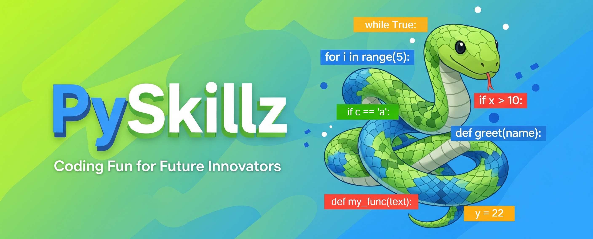

# Welcome to the PySkillz Contributor Guide 🎉

We’re thrilled you’re here! By contributing to PySkillz, you’re helping us build the most comprehensive collection of skill-building exercises for new Python programmers on the Internet. Your contributions are not only valuable to learners worldwide, but also a great way to sharpen your own skills and experience with open source collaboration.

This guide will walk you step by step through the contribution process. By the end, you’ll know exactly how to get your work included in the PySkillz repository.

Here’s what we’ll cover:

1. The recommended GitHub workflow — how to fork, branch, commit, and submit pull requests.

2. The files needed to create an exercise — understanding the structure of a PySkillz exercise.

3. The details that go into the exercise itself — writing clear instructions, solutions, and explanations.

Ready to make your first contribution? Let’s dive in 🚀

# Step 1: Set Up Your Local Workspace

Before you can contribute to PySkillz, you’ll need your own copy of the repository to work on. Here’s how:

1. Fork the PySkillz repository on GitHub

  * Go to the [PySkillz GitHub page](https://github.com/Timinator2000/PySkillz).

  * Click the Fork button in the top-right corner.

  * This creates your own copy of PySkillz under your GitHub account.

2. Make sure Git is installed locally

  * On most systems, you can check by opening a terminal and running:

```bash
git --version
```

* If Git is not installed, download it from [git-scm.com](https://git-scm.com/) and follow the installation instructions for your operating system.

* 💡 Tip: When you install Git on Windows, you’ll also get Git Bash—a lightweight terminal that makes running Git commands easier. We recommend using Git Bash for this guide.

3. Clone your fork to your local machine

  * Navigate to your new fork on GitHub.

  * Click the green Code button and copy the HTTPS URL.

  * In your terminal (or Git Bash on Windows), run:

```bash
git clone <your-fork-url>
```

  * This creates a local copy of your forked repository that you can work in.

After completing these steps, you’ll have your own local workspace connected to your GitHub fork. All of your changes will be made here before being submitted back to the main PySkillz project.

With the repository successfully cloned to your local machine, the next step is to examine its structure. Understanding the organization of files and directories is essential before you begin making contributions.

<BR>

************

[](skillz-catalog)
